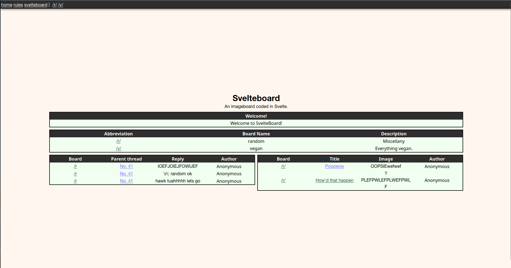

# Svelteboard



An imageboard created with Svelte. No client-side Javascript so is safe for TOR and other applications.

## Deployment

Deploying other people's software, especially the ones you find in their GitHub repos, is a huge pain in the ass. If something in here confuses you, please open an issue or DM me!

I also recommend you deploy this on a Linux machine. Windows is truly only good for gaming and other niche applications. Ubuntu works best.
### Priors (you'll need):
- A Supabase instance, cloud is fine. If you want maximum control over your data, though, i.e., you live under an oppressive government, look into performing a local deployment of Supabase.
- NodeJS and NPM.

### Installation & Setup
First, clone the repo

```bash
git clone https://github.com/imake-ds-team/svelteboard.git
```

Then, install all dependencies
```bash
npm install
```

Then, rename `.env.example` to `.env` and thats where all of your configurations can be found.

#### Customization
You can go to `app.css` and alter the variables there. You can also install custom fonts with a [webfont generator](https://www.fontsquirrel.com/tools/webfont-generator). I like to get my fonts for free from [Dafont](https://www.dafont.com/).

### Supabase Project Setup
After you intialize your project, go to your SQL editor and create your table for boards:

```sql
create table boards (
  id bigint generated by default as identity primary key,
  inserted_at timestamp with time zone default timezone ('utc'::text, now()) not null,
  name text unique not null,
  abbreviation text unique not null,
  description text not null
);

alter table boards enable row level security;

create policy "Anyone can read boards."
on boards for select
to anon
using ( true );
```

now create your table for threads:

```sql
create table threads (
  id bigint generated by default as identity primary key,
  inserted_at timestamp with time zone default timezone ('utc'::text, now()) not null,
  title text not null,
  content text not null,
  gtripcode text null,
  board not null,
  image_url text null
);

alter table threads enable row level security;

create policy "Anyone can read threads."
on threads for select
to anon
using ( true );

create policy "Anyone can insert threads."
on threads for insert
to anon
with check ( true );

create policy "Anyone can delete threads."
on threads for delete
to anon
using ( true );
```

and create your table for posts:

```sql
create table posts (
  id bigint generated by default as identity primary key,
  inserted_at timestamp with time zone default timezone ('utc'::text, now()) not null,
  content text not null,
  image_url text not null,
  parent_thread_id text not null,
  parent_thread_board text not null
);

alter table posts enable row level security;

create policy "Anyone can read posts."
on posts for select
to anon
using ( true );

create policy "Anyone can insert posts."
on posts for insert
to anon
with check ( true );

create policy "Anyone can delete posts."
on posts for delete
to anon
using ( true );
```

Finally, create a new bucket called `threads-uploads`, make it public, with the accepted MIME type being all images, with whatever file upload limit you want. Return to your SQL editor and run

```sql
CREATE POLICY "Permissive Policy qo2jqm_0" ON storage.objects FOR INSERT TO public WITH CHECK (bucket_id = 'threads-uploads');
CREATE POLICY "Permissive Policy qo2jqm_1" ON storage.objects FOR SELECT TO public USING (bucket_id = 'threads-uploads');
CREATE POLICY "Permissive Policy qo2jqm_2" ON storage.objects FOR DELETE TO public USING (bucket_id = 'threads-uploads');
```

### How do I...

#### Add new boards?
Go to your `boards` table and create a new row.

#### Delete threads/replies?
Take your `ADMIN_PASSWORD` and delete threads/replies with that. The tripcode form accepts the correct tripcode AND the `ADMIN_PASSWORD`.